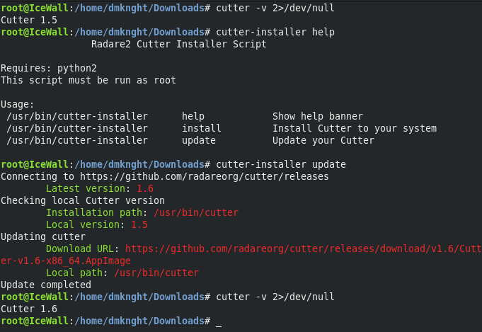

# cutter_installer
A simple script that automatic download and install Radare2 Cutter (release version) to your system. This script is currently support Linux only

- Requires: python2

# Install to a custom location?
- edit `DEFAULT_PATH` as your binary Cutter location
- edit `DESKTOP_PATH` as your shortcut location (comment it if you don't want to use it)

